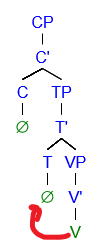

== Clause combinations

=== Complement clauses

====
_CP = C C' +
_C' = VP_
====

Complement clauses act as the subject or object of a main clause.

A finite clause is inflected separately to the main clause. When used as a
subject, the complementiser _tii_ is prefixed to the auxiliary of the complement
verb. If the complement clause is in present tense, the auxiliary appears
regardless of normal elision. The other argument in the sentence drops its case
marking (so the bare form of the noun is used instead).

====
_annoy.AUX-PST COMP-eat-AUX-PST he-ERG dog-ABS eat-3-AN me-ABS annoy-1-AN_ +
That he ate the dog annoyed me.
====

A finite clause can also be used as a direct object (but not indirect). Here, it
has a null complementiser.

A non-finite clause shares its subject with the main clause. It can only be used
as an object (both direct and indirect). Non-finite clauses do not have an
auxiliary - the infinitive of the verb is used instead, and is moved to the T
position. The subject is eleided, and all remaining objects are cased as normal.

=== Adverbial clauses / adjuncts

==== Conditional

A conditional places a condition on another statement. They are formed
through two verb phrases, one representing the condition (or protasis)
and the other representing the outcome (or apodosis). There are two
types of conditional:

* _implicative_, where the conditional represents a universal truth.
Whenever the condition is true, the outcome is also true. It is
important to remember that the implicative form is always true. A
statement such as "When the wind blows, the leaves rustle" meets this
criteria, whereas "If you go there, you'll be attacked" does not.
* _predictive_, where the conditional represents a prediction. This is
the more general form, and can be used without worrying about universal
truth.

To form both conditionals, the condition verb phrase appears first,
followed immediately by the outcome verb phrase. No connector is
necessary between the two clauses (i.e. there is no equivalent to "if").
The outcome phrase is always placed in the subjunctive mood and present
tense.

In an implicative conditional, the condition is given the gnomic mood
and the present tense. The statement must therefore follow the usual
rules of the gnomic, in that it must state an indisputable truth.

====
*k-i-nga kunii-ø mu-rn naa yarr-uu-n j-i-tirlu kunii-j ka mulj-awuu-n* +
_fall.aux-prs-gno 2dual.ch-erg water-loc 1.val.2 fall-ch-2nd wet.aux-prs-sbjv 2dual-ch-nom 2.val.1 wet-ch-2nd_ +
If you two fall in the water, you will both get wet.
====

In a predictive conditional, the condition is usually not given a mood,
but can assume any tense.

====
*nn-uuki palwuuwa-j ka girnn-aa-mi k-i yannu-ø nna-j ji wurr-a-rn* +
_ break.aux-fut branch-nom 2.val.1 break-inan-3rd strike.aux-pres dem.sg.inan-erg 3s-an-nom 0.val.2 strike-inan-3rd_ +
If that branch breaks, it will strike him.
====

There is one exception to this rule. If the condition is seen as
unlikely, the phrase is a _counterfactual_. In this case, the
condition is given the dubitative mood. Usually, the condition will then
be in the future tense.

====
*k-aa-tila nna-ø maaju-j yirn parr-u-m ngarr-tiru nurtwa-nurtwa-rn yuni waya-j ngurr-a-m* +
_hunt.aux-fut-dub 3s.an-erg kangaroo-nom completedly hunt-an-3rd be.aux-subj food-pl-loc lots 1pl-nom be-inan-3rd_ +
If he were to successfully hunt the kangaroo [unlikely], we would have lots of food.
====

=== Clause chaining, medial clauses, and switch reference

A medial clause is any non-final clause in a clause chain. It is not usually
inflected for tense and aspect, taking instead the T/A of the final clause in
the sentence.

====
3S-ERG _walk-3-AN-SS pat-AUX-PST dog-ABS pat-3-AN_ +
He patted the dog while walking.
====

In the above example, the clause containing _walk_ is medial, and hence does not
require an auxiliary to mark tense and aspect. The final clause, containing
_pat_, determines that both verbs in the chain are in the past tense.

An exception to the missing TAM inflection occurs when the medial clause has a
mood with higher specificity than that of the final mood. The specificity
heirarchy that determines this is:

====
(less specific) gnomic - dubitative - weak imperative - strong imperative (more specific)
====

The subjunctive falls outside this spectrum, and does not inflect in medial
clauses. If the final clause has no mood, then no mood can be expressed on
medial clauses.

====
1pl-ERG _eat.AUX-STRIMP eat-1-AN-SS swim.AUX-WIMP swim-1-AN_ +
We must eat before we (can) swim.
====

The subject of a medial clause is determined by reference markers. Ngujari is a
switch-reference language: it determines the subject of a medial clause based on
whether it is the same as, or different from, that of the final clause. The SS
marker refers forwards to indicate that the clause has the same subject, and the
DS marker indicates the opposite.

The morphological realisation of the SS/DS markers depends on the context of the
sentence. There are four different contexts in which switch-reference operates,
each with a different morphology.

==== Overlap

Overlap represents the "while doing X" relationship.

====
_1pl-ERG walk-1-AN-SS talk-1-AN_ +
We walked and talked / We talked while walking.

_dog-ERG bark-3-AN-DS escape-AUX-PST prisoner-ERG escape-3-AN_ +
The dog barked while the prisoner escaped.
====

==== Succession

Succession represents the "after doing X" relationship.

====
_car-ERG arrive-3-INAN-DS enter-3-AN_ +
The car arrives, then he gets in.
====

In the above example, the DS marker is enough, along with the person and number
marking on the verb, to infer the subject of the medial clause without making it
explicit.

==== Causation

Causation represents the "because of X" relationship.

====
_arrive-3-AN-SS early drink.AUX-FUT excessively drink-3-AN_ +
Since she will arrive early, she will get drunk.
====

==== Negative causation

Negative causation represents the "because of not-X" relationship.

Negative causation is the only non-canonical switch-reference context. Instead
of marking the medial verb, the negative particle is marked. In addition, only
same-subject reference is allowed.

====
_NEG-SS wake-3-AN avoid.AUX-PST bus-ABS avoid-3-AN_ +
Because she didn't wake up, she missed the bus.
====

TODO: show example of different tenses / DS both needing more complicated causative.

.SS/DS markers
[options="header"]
|=======================
| type               | SS | DS
| overlap            |    |
| succession         |    |
| causation          |    |
| negative causation |    |
|=======================

=== Relative clauses

There are two types of relative clause.

==== Postnominal relative clause

This clause relativises the subject position.

====
_man-ERG go.AUX-PST shop-PL-ABS go-3-AN_ +
the man who went to the shops
====

The relative clause immediately follows the noun. The auxiliary must be
included, even if the clause is in the present tense (where it would normally be
optional).

image:../images/postnominal-relative-clause.png[]

The gap strategy is used for case retention - since the case must be the subject.

==== Adjoined relative clause

This clause relativises direct and indirect objects, using the relative pronoun
strategy for case retention.

The relative clause is adjoined after the main clause, and introduced by the
complementiser *tii* which appears as a particle. The clause is a complete
clause, where the head noun is replaced by the matching demonstrative pronoun
referring back to the modified noun.

====
_turtle-ABS see-1-AN, [COMP 1s-ERG DEMPRON.AN.S-ABS like-1-AN]_ +
I see the turtle that I like [direct object].

_man-ABS know-1-AN, [COMP tree-ERG DEMPRON.AN.S-ORI fall-3-INAN]_ +
I know the man that the tree fell on [indirect object].
====

TODO: X-bar diagram

=== Coordination

Apart from medial clause-chaining, Ngujari does not have any concept of
coordination inside clauses.

Instead, different logical constructions are formed in unique ways.

==== Conjunction

Conjunction is expressed between NPs or VPs.

When nouns are coordinated through conjunction, only one is used as the "main"
subject of the sentence. Others are attached to the main NP through a relative
clause, which expresses their relationship, usually in locative terms (e.g.
alongside, on top of).

====
_fight.AUX-PST 1s-ERG bear-ABS fight-1pl-AN, [COMP sister-ERG 1s-ABS be.alongside-1-AN]_ +
My sister and I fought the bear.
====

In the above example, the speaker is the main subject, while their sister is
attached via a relative clause. Notice that the number of the verb _fight_ is
changed to reflect that there are two subjects to the sentence.

Conjuncted verb phrases are expressed either through overlapping medial clauses
or through a separate sentence with a conjunction-indicating adverb, one of:

* also (implies second event occurs at the same location and time as the first)
* at same time (implies second event occurs at the same time as the first)

====
_boat-ABS find-AN-1ST DEMPRON-INAN-S-ABS steal-1-an also_ +
I find a boat and steal it.
====

==== Disjunction

Disjunction is expressed between verb phrases only, using the dubitative mood.

====
_go.AUX-PRES-DUB 1S.NOM go-AN-1ST ↗︎wait.AUX-PRES-DUB 1S.NOM wait-AN-1ST↗︎_ +
I will go now or wait.
====

// TODO: example of question using disjunction
