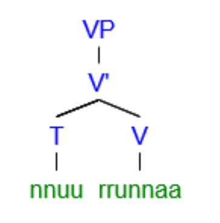
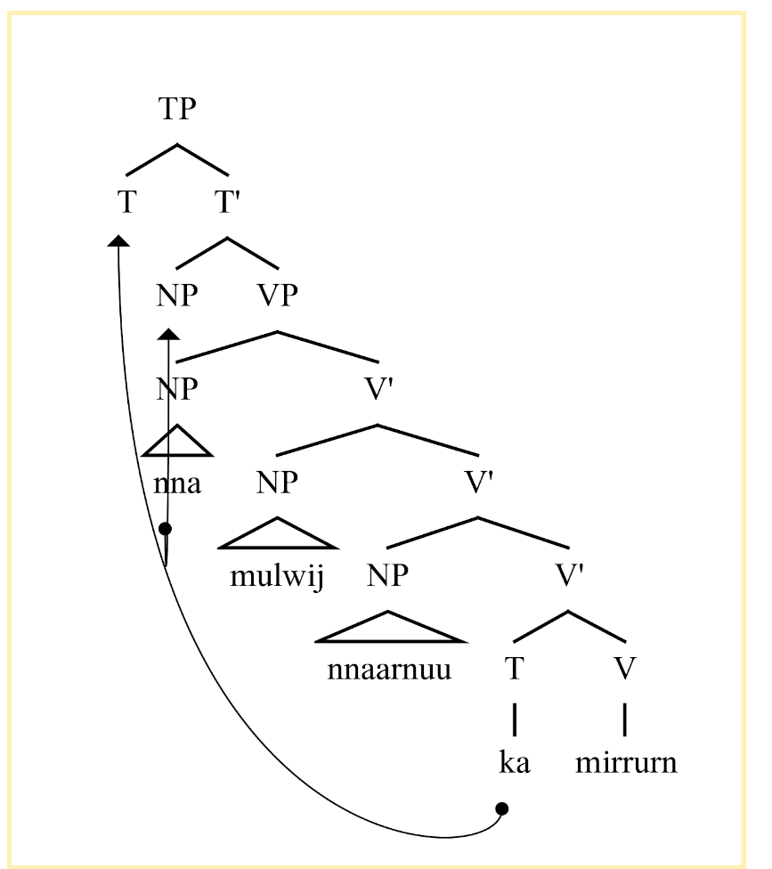
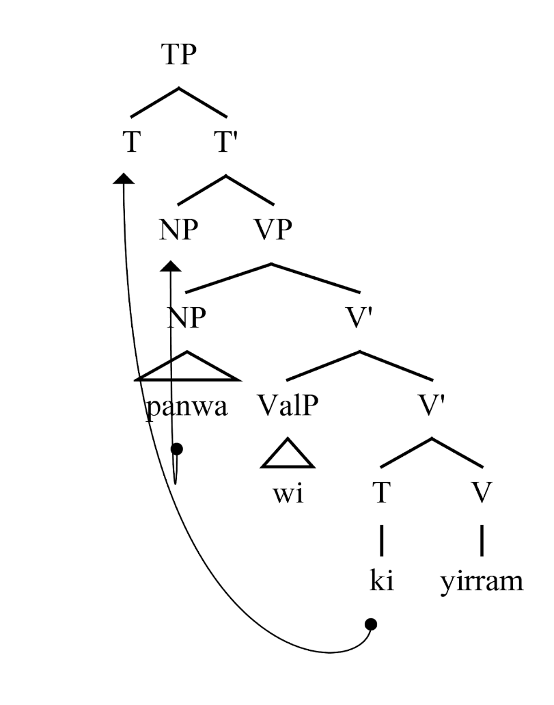
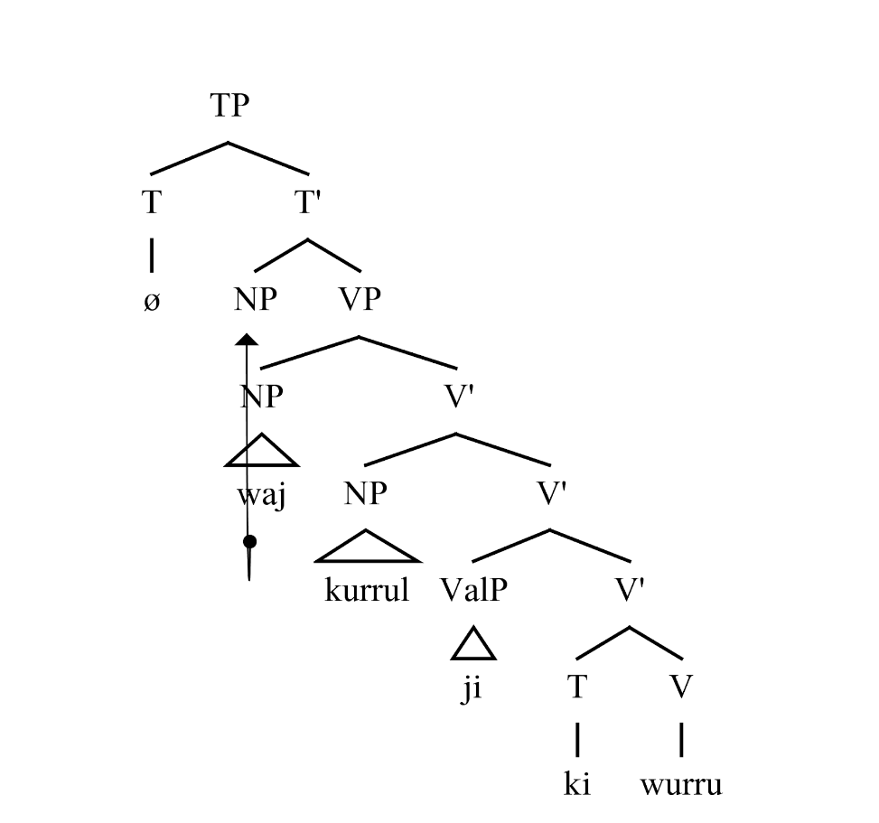
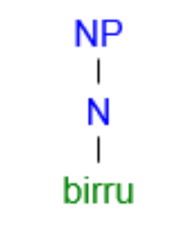

== Constituent order typology

=== Introduction

=== Constituent order in main clauses

Within a clause, nouns can take on one of multiple roles:

* The _agent_ of a transitive verb, which is a noun performing an action
on another noun.

====
*k-a wiingurki-ø taarirkiwa-j pirr-uu-m* +
_see.AUX-pst boy-erg stick-nom see-ch-3rd_ +
The boy saw the stick.
====

* The _patient_ of a transitive verb, or the noun that an action is
being performed on.

====
*k-a wiingurki-ø taarirkiwa-j pirr-uu-m* +
_see.AUX-pst boy-erg stick-nom see-ch-3rd_ +
The boy saw the stick.
====

* The _subject_ of an intransitive verb, which is a verb that only
requires one noun. For example, in the sentence "The dog barks", the dog
is the subject.

====
*nn-uu mungu-j wi rrunn-u-m* +
_cry.aux-pst woman-nom 0.val.1 cry-an-3rd_ +
The woman cries.
====

Inside a clause, Ngujari tends to be an APV/SV language. This means that
the agent and patient precede the verb in a transitive clause, and the
subject precedes the verb in an intransitive clause.

====
*wann-uma maaju-maaju-j ka jinn-u-m* +
_see.aux-pst kangaroo-pl-nom 2.val.1 eat-an-3rd_ +
The kangaroos ate/were eating.

*k-i wa-j kurru-l ji wurr-u-ø* +
_strike.aux-pres 1s-nom 2s-acc 0.val.2 electrically.storm-an-1st_ +
I strike you.
====

When the valence of a clause's verb is greater than two, all extra
arguments come before the verb.

====
*nn-uu waya-ø tinyu-j panwa-yi naa tinn-u-ø* +
_protect.aux-pres 1pl-erg camp-nom fire-com 2.val.3 protect-an-1st_ +
We protect the camp with fire.
====

The presence of the verb at the end of the clause is fixed, but the
order of the nouns is flexible for pragmatic reasons. The speaker can
reverse agent and patient.

====
*k-i kurru-l wa-j ji wurr-u-ø* +
_strike.aux-pres 2s-acc 1s-nom 0.val.2 electrically.storm-an-1st_ +
I strike you.
====

The majority of the time, the agent will precede the patient. But if the
speaker is drawing attention to the patient, especially if the agent has
already been discussed and the patient is being introduced, it may move
to the position of importance before the agent.

=== Verb phrase

====
Verb Phrase: _vp = aux [neg] np(s) [adv(s)][val] v_ +
_VP = (NP) V'_ +
_V' = V' AdvP_ +
_V' = AdvP V'_ +
_V' = NP V'_ +
_V' = ValP V'_ +
_V' = T V_
====

A _verb phrase_ is the primary structure of a clause. The most basic
clause possible is an avalent footnote:[An avalent verb is one that takes
no nouns or arguments.] verb. This is demonstrated in the following
example:

====
*nn-uu rrunn-aa* +
_rain.aux-pres rain-inan-1st_ +
It's raining.
====

In practice, most verb phrases will involve nouns. While word order is
flexible, as previously described, there are three rules which generally
apply:

1.  The verb's auxiliary appears at the beginning of the phrase.
2.  The verb itself appears at the end.
3.  Valence modifiers appear immediately before the verb.

====
*k-a nna-ø mulwi-j nnaa-rnu mirr-u-m* +
_bring.aux-pst 3s-erg bread-nom 3pl-ori bring-an-3rd_ +
He brought the bread to them.
====

// TODO: these are wrong - can't generate T in V'

====
*k-i panwa-ø wi yirr-a-m* +
_burn.aux-pres fire-erg 0.val.1 burn-inan-3rd_ +
The fire burns.
====

However, for pragmatic reasons the speaker may move the verb's auxiliary
from its regular position at the beginning of the clause to after the
verb's arguments. It must appear _after_ any valence modifiers to avoid
violating the verb phrase rules.

====
*kurru-l wa-j ji k-i wurr-u-ø* +
_2s-acc 1s-nom 0.val.2 strike.aux-pres electrically.storm-an-1st_ +
I strike you.

*wa-j kurru-l ji k-i wurr-u-ø* +
_1s-nom 2s-acc 0.val.2 strike.aux-pres electrically.storm-an-1st_ +
I strike you.
====

=== Noun phrase

====
_NP = N'_ +
_N' = N (CP)_
====

A verb phrase can take more than just bare nouns. A _noun phrase_ is a
constituent which acts like a noun. It can contain the noun alone, but
can also be modified by a relative clause.

The relative clause always appears at the end of the noun phrase

====
*birru-ø* +
_sea-erg_ +
sea
====

====
*kanaama yirlirna-j gu* +
_woven basket-nom small_ +
small woven basket
====

==== Relative Clauses

Relative Clause: _rc = [aux][neg] v [val][adv(s)] np(s)_

A relative clause is a clause which modifies a noun (the _head noun_).
Ngujari uses _adjoined_ relative clauses, which means that the relative
clause is simply appended to the end of the verb. However, it must first
be placed into a slightly different form than a standard clause.

There are two cases for a relative clause:

* _object clauses_, in which the head noun is the object of the
relative clause.
* _agent clause_, where the head noun is the relative clause's agent
or subject.

In both types of relative clause, the verb is moved from the end of the
clause to a position immediately following the verb's auxiliary.

In an object clause, the valency of the verb is reduced by one. In
effect, the head noun becomes a noun in the clause.

====
*wiingu-ø k-a pirr-u-ø ka wa-j* +
_man-erg aux-pst see-an-1st 2.val.1 1s-nom_ +
the man that I saw
====

In an agent clause, the valency is not modified. Instead, a pronoun that
matches the person, plurality, and animacy of the head noun is added to
the relative clause.

====
*j-a Wuurna-ø nn-uuki-ti yann-u-mi nna-j jurlu-l wa-j ka naj-u-m* +
_say.aux-pst Wuurna-erg aux-fut-dub catch-an-3rd 3s-nom turtle-acc 1s-nom 3.val.2 say-an-3rd_ +
Wuurna, who might catch a turtle, spoke to me.
====

=== Adpositional phrases

=== Comparatives

A comparative is a sentence which compares one noun to another, using an
adjective. Ngujari uses _locational-type comparatives_ which are
verbless. The noun to be judged against (the _standard noun_) is given
a locational case, while the noun that is being judged is given the case
that it would assume as the subject of an intransitive verb. The two
nouns are then followed by the adjective, which is in the predicate form
(see *morphology*).

If the judged noun is 'more' of the adjective than the standard noun,
the revertive case is used. If they are the same, the locative case is
used.

====
*nna-j wa-rna yam-u* +
_3s-nom 1s-rev tall-an_ +
He is taller than me.

*gungaa-ø muyu-rn yurli-la* +
_axe-erg spear-loc dull-inan_ +
The axe and spear are equally as dull.
====

Comparatives may be used in relative clauses. The adjective becomes the
first word in the clause and is followed by the nouns. One of the nouns
is replaced by a pronoun as usual.

====
*k-a nnalji-ø junn-u nna-ø wiinguurki-rna yuki-j ka giirr-u-m* +
_win.aux-pst dingo-erg fast-an 3s-erg boy-rev race-nom 2.val.1 win-an-3rd_ +
The dingo, who is faster than the boy, won the race.
====

=== Modifier Positioning

==== Adjectives

// TODO

==== Adverbs

Adverbs can be split into two categories:

* Temporal adverbs specify the time a verb takes place
* Manner adverbs detail the manner in which the verb was conducted

Temporal adverbs usually follow the base verb.

====
*k-a jana-ø jari-rn wiirr-uu-ø yuurli-rna ma* +
_go.aux-pst 1s.ch-erg beach-loc go-ch-1st day-rev one_ +
Yesterday, I [a child] went to the beach.
====

Manner adverbs usually precede the base verb.

====
*nn-uuki-yii waya-ø pirwa-pirwa-j garrna gann-u-ø* +
_pickup.aux-fut-wimp 1pl-erg clothing-pl-nom quickly pickup-an-1st_ +
We should pick up the clothes quickly.
====

However, both can occupy different positions inside the verb phrase if
the speaker desires it.

=== Interrogative

_Interrogatives_ are simply questions. There are two types of
interrogatives:

* _Polar_, which have an affirmative or negative answer.
* _Non-polar_, which require a more detailed response.

==== Polar

Polar questions are extremely easy to form. They are expressed as a
factual statement, but with a rising tone at the beginning of the
question.

====
*nn-uuki kupa-kupa-ø gaypa-gaypa-rn narnn-u-m?* +
_↗ fly.aux-fut bird-pl-erg mountain-pl-loc fly-an-3rd_ +
Will the birds fly to the mountains?
====

==== Non-Polar

The primary way of forming a non-polar question is through the use of
interrogative pronouns (such as _piima_). The interrogative takes the
place of a noun in a verb phrase, but is not assigned a case.

====
*k-a pii munnanna-rn wa-yi naa wiirr-u-m* +
_go.aux-pst who river-loc 1s.an-com 2.val.3 go-an-3rd_ +
Who went to the river with me?
====

This method of questioning can be used in any type of sentence, not just
basic clauses. The following example shows its use in a locational
predicate which contains a relative clause. The interrogative pronoun,
_kiru_, is moved to the front of the sentence to highlight its
importance.

====
*kiru ngarr-i wumpa-ø j-i palyaj-a-m nnu-ø wurlki-j ngurr-a-m* +
_where be.aux-pres path-erg leadto.aux-prs leadto-inan-3rd 3s.inan-erg village-nom be-inan-3rd_ +
Where is the path that leads to the village?
====

A less-common way to ask a non-polar question requires the particle
_yuu_. By placing the particle ahead of a word in a statement, the
speaker questions that word.

====
*k-aa yuu-nnara-ø nurtwu-j panwa-rnu mirr-uu-m* +
_bring.aux-fut int-3dual.an-erg food-nom fire-ori bring-ch-3rd_ +
Will it be those two children who bring the food to the fire?

*nn-i wa-ø yuu-gurlurni parnti-j jinn-u-mi* +
_eat.aux-pres 3s-erg int-fresh kangaroomeat-nom eat-an-3rd_ +
Is the kangaroo meat he is eating fresh?
====

=== Conditional

A conditional places a condition on another statement. They are formed
through two verb phrases, one representing the condition (or protasis)
and the other representing the outcome (or apodosis). There are two
types of conditional:

* _implicative_, where the conditional represents a universal truth.
Whenever the condition is true, the outcome is also true. It is
important to remember that the implicative form is always true. A
statement such as "When the wind blows, the leaves rustle" meets this
criteria, whereas "If you go there, you'll be attacked" does not.
* _predictive_, where the conditional represents a prediction. This is
the more general form, and can be used without worrying about universal
truth.

To form both conditionals, the condition verb phrase appears first,
followed immediately by the outcome verb phrase. No connector is
necessary between the two clauses (i.e. there is no equivalent to "if").
The outcome phrase is always placed in the subjunctive mood and present
tense.

In an implicative conditional, the condition is given the gnomic mood
and the present tense. The statement must therefore follow the usual
rules of the gnomic, in that it must state an indisputable truth.

====
*k-i-nga kunii-ø mu-rn naa yarr-uu-n j-i-tirlu kunii-j ka mulj-awuu-n* +
_fall.aux-prs-gno 2dual.ch-erg water-loc 1.val.2 fall-ch-2nd wet.aux-prs-sbjv 2dual-ch-nom 2.val.1 wet-ch-2nd_ +
If you two fall in the water, you will both get wet.
====

In a predictive conditional, the condition is usually not given a mood,
but can assume any tense.

====
*nn-uuki palwuuwa-j ka girnn-aa-mi k-i yannu-ø nna-j ji wurr-a-rn* +
_ break.aux-fut branch-nom 2.val.1 break-inan-3rd strike.aux-pres dem.sg.inan-erg 3s-an-nom 0.val.2 strike-inan-3rd_ +
If that branch breaks, it will strike him.
====

There is one exception to this rule. If the condition is seen as
unlikely, the phrase is a _counterfactual_. In this case, the
condition is given the dubitative mood. Usually, the condition will then
be in the future tense.

====
*k-aa-tila nna-ø maaju-j yirn parr-u-m ngarr-tiru nurtwa-nurtwa-rn yuni waya-j ngurr-a-m* +
_hunt.aux-fut-dub 3s.an-erg kangaroo-nom completedly hunt-an-3rd be.aux-subj food-pl-loc lots 1pl-nom be-inan-3rd_ +
If he were to successfully hunt the kangaroo [unlikely], we would have lots of food.
====
