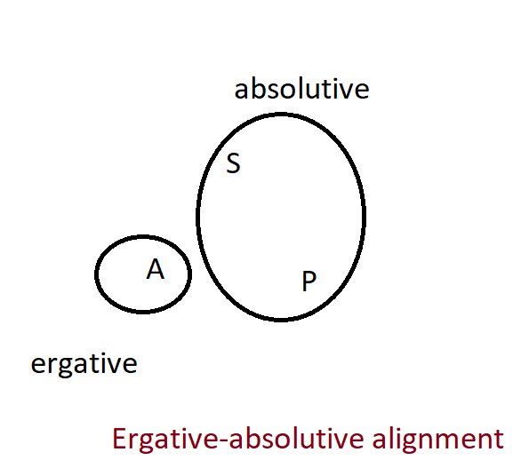
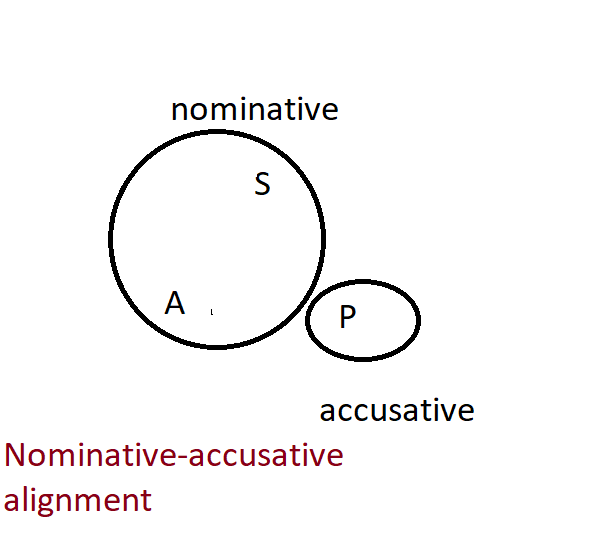

== Grammatical relations

=== Systems for grouping S, A, and P

Constituent noun phrases in Ngujari sentences can be divided into three
categories.

In an intransitive clause, there is one argument to the verb, termed the
subject.

====
_woman-ABS capsize-an-3rd_ +
The woman capsizes.
====

In a transitive clause, there are two arguments. The first is the agent, which
is the noun performing or causing the action. The second is the patient, which
receives, undergoes, or otherwise experiences it.

====
_kill.AUX-PST 3s.AN-ERG snake-NOM kill-AN-3RD_ +
He killed a snake.
====

Grammatical relations define groups of these categories. The grammatical
relations in clauses are decided by an agentivity heirarchy:

====
personal pronoun > animate > inanimate
====

If there are any arguments in a clause occupying the subject, agent or patient
role which are _not_ personal pronouns, grammatical relations are assigned as in
<<erg-abs-alignment>>. The ergative relation contains the agent of transitive
clauses, while subject and patient are grouped together into the absolutive
relation.

[#erg-abs-alignment]
.Ergative-absolutive alignment

// TODO: insert colour-coded example sentence

If there are only personal pronouns in the sentence's subject, agent, and
patient categories, relations are assigned differently, as in
<<nom-acc-alignment>>. Since these nouns are considered more 'agent-like', and
capable of volition in all circumstances, the subject and agent are treated
identically by grouping them into the nominative relation. The patient stands
alone in the accusative relation.

[#nom-acc-alignment]
.Nominative-accusative alignment

The relation of a noun is realised morphologically. A noun receives a case
marking as a suffix, which represents the relation.

The aligment of a sentence represents the grammatical relations present in it.
Ngujari is a split-ergative language: in clauses with only personal pronouns, it
is nominative-accusative; otherwise, it is ergative-absolutive.

// TODO: insert examples

These two alignments are maintained in both main and dependent clauses, such as
relative clauses.

// TODO: insert examples of both

=== Syntactic ergativity

While ergativity is primarilly a noun-phrase operation, there a some examples of
it being more widely evident in the language's consturctions.

A key distinction which falls along aligment lines is relativisation. The
relativsed noun phrase must be absolutive; meaning that a swntence in
nominative-accusative alignment (that is, containing only animate pronouns)
cannot contain a relative clause.

Inside the relative clause, the noun phrase can be a patient of an intransitive
phrase or the subject of an intransitive phrase.

// TODO: insert examples of both
// TODO: is the above still relevant with new relative clauses?

Another syntactic construction that is sensitive to alignment is conjunction
reduction. When a conjunction joins two phrases, the noun phrase in the first
which is absolutive can be elided in subsequent phrases.

// TODO: insert example such as "Cadel ate pie and he coughed"
// TODO: this might be irrelevant now that we have clause chaining

=== Morphological ergativity

Alignment is expressed morphologically in the case of 'professionalistion', a
subclass of nominalisation. When a verb is converted into a term for someone who
habitually does the action (e.g. crawl -> crawler), the process occurs according
to ergative-absolutive lines. The suffix _ngu_ is used to professionalise verbs
in the ergative position, while those in the absolutive position take the suffix
_TODO_.

// TODO: insert examples
