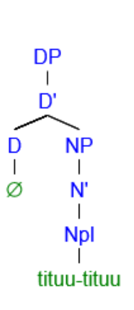
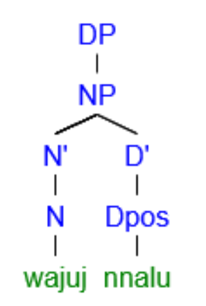
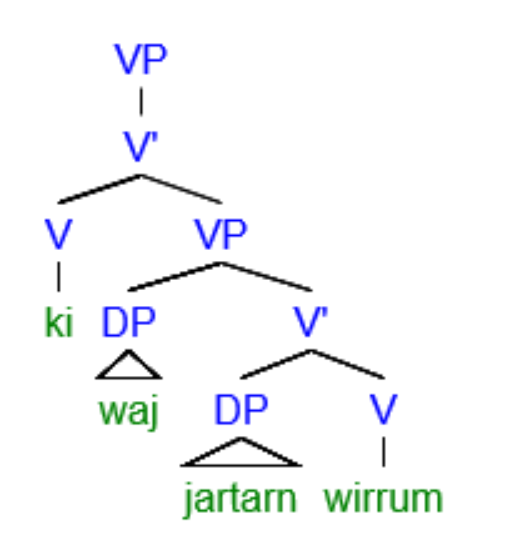

== Morphological typology

=== Morphological processes

Ngujari is a polysynthetic language; the words in most grammatical categories cannot be used in their stem form without support. They must be inflected to indicate different dimensions and add layers of meaning. For nouns, these dimensions are modifiers like case and number, while verbs can indicate tense, person, and more.

The language is overwhelmingly _agglutinative_: words are inflected
through non-fusional suffixes alone.

However, in a handful of cases words are instead inflected through
_clitics_, separate words which are "attached" to the stem by their
relative position in the sentence. The most common occurrence are
particles which modify verbs, such as the negative particle.

Consider the following sentence:

====
*k-a wa-Ø jari-rn wiirr-u-Ø* +
_go.AUX-PST 1s-ERG beach-LOC go-AN-1ST_ +
I went to the beach.
====

The sentence contains three stems: _wiirr_ (to go), _jari_ (beach), and
_wa_ (_I_). However, these stems cannot be used alone. Each has at
least one additional morpheme.

* _wa_ is inflected into the ergative case, through the _null
morpheme_ footnote:[Although it cannot be heard in the spoken language,
the null morpheme is considered to be a morpheme due to its role in
differentiating different word forms.], a morpheme which has no sound.
* _jari_ is inflected into the locative case, through the suffix
_-rn_.
* _wiirr_ is inflected into the animate adult gender, through the suffix
_-u_, and the first person singular, through the null morpheme. It
also has an auxiliary (discussed later), _k_, which is inflected into
the past tense through the suffix _-a_.

=== Head/dependent marking

Ngujari is head-marking, meaning that the heads of phrases are marked
for relationships with dependents.

For example, nouns themselves are marked for plurality, rather than the
null determiner.

Possessives provide another example of head-marking. The owning pronoun
is marked with the possessive suffix, rather than the owned noun.

====
*waju-j nna-lu* +
_face-nom 3s.an-pos_ +
his face
====

In verb phrases, the verb (head) is marked for information like tense
and valence, rather than the arguments.

====
*k-i wa-j jarta-rn wiirr-u-m* +
_go.aux-PRES 1s-nom home-LOC go-an-1st_ +
I go home
====

